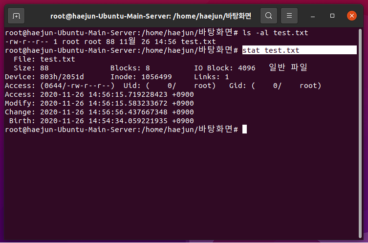

# 1 시스템 기본 학습

## /etc/passwd 파일

- **[user_account] : [user_password] : [user_ID] : [group_ID] : [comment] : [home_directory] : [login_shell]**

## 사용자 확인

## 패스워드 변경

## /etc/group 파일

- **[group_name] : [unvariable] : [group_ID] : [user_account_entry_in_group]**

## inode list

- 파일에 대한 속성 정보 담고 있다.
- 침해 사고가 발생하게 되면, 피해 시스템 파일에 대한 결성 확인을 위한 타임라인 분석을 수행한다.
  - 이때 파일 시스템 inode 구조체의 MAC Time을 점검한다.